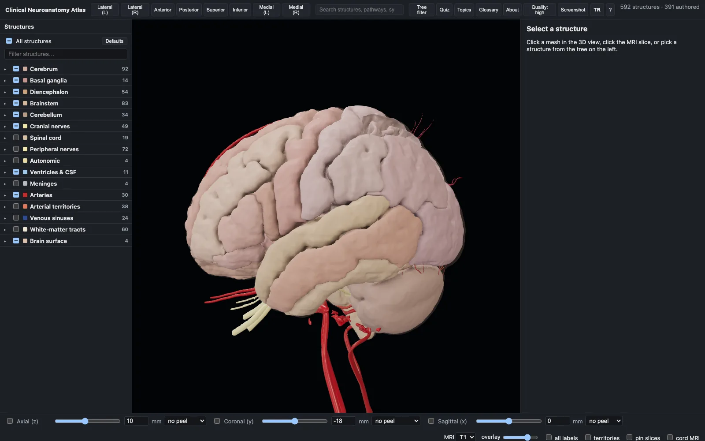
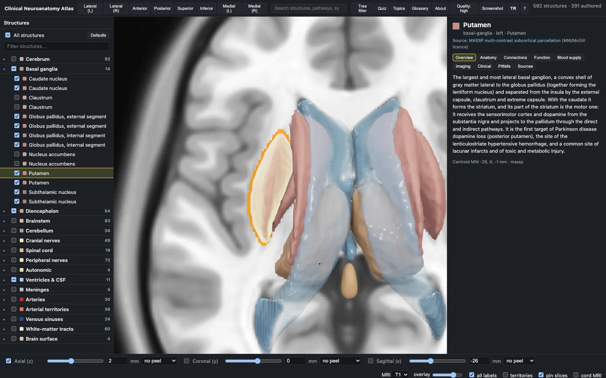
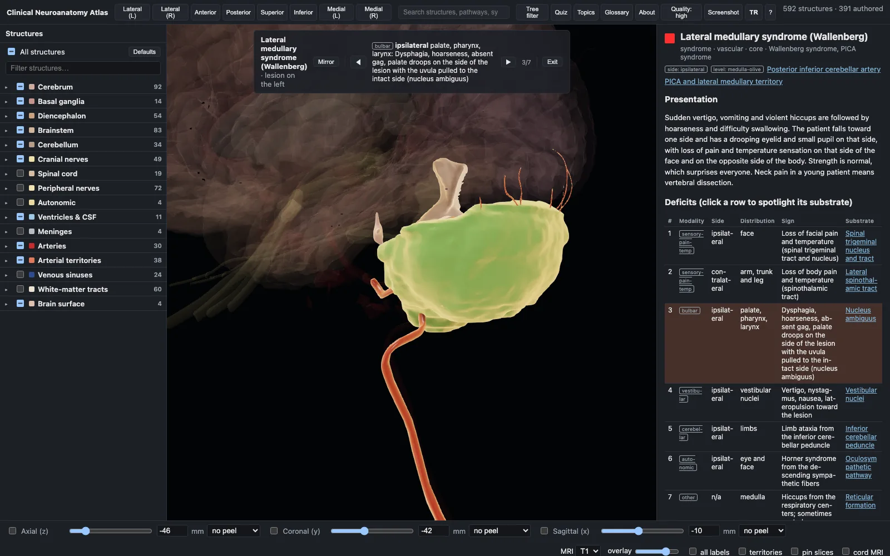
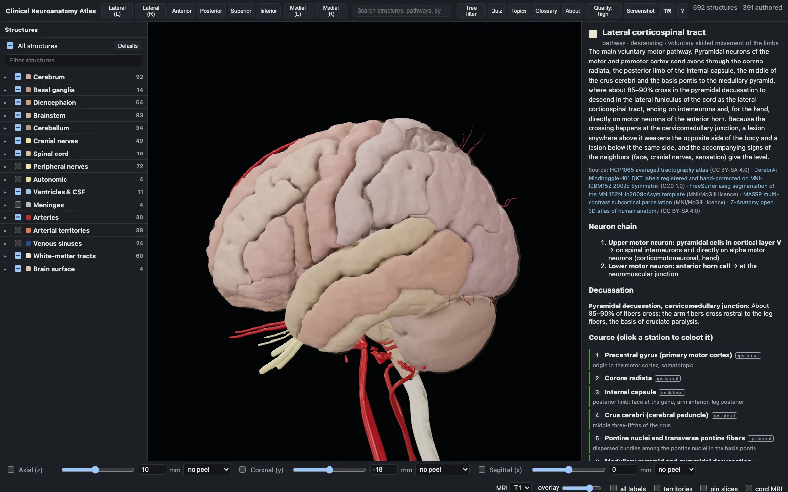
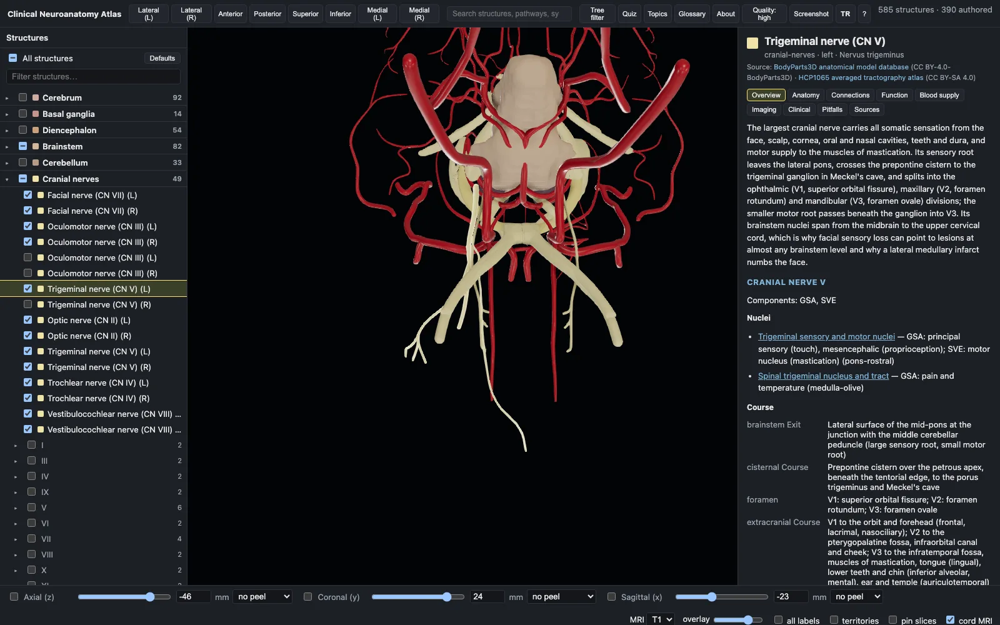
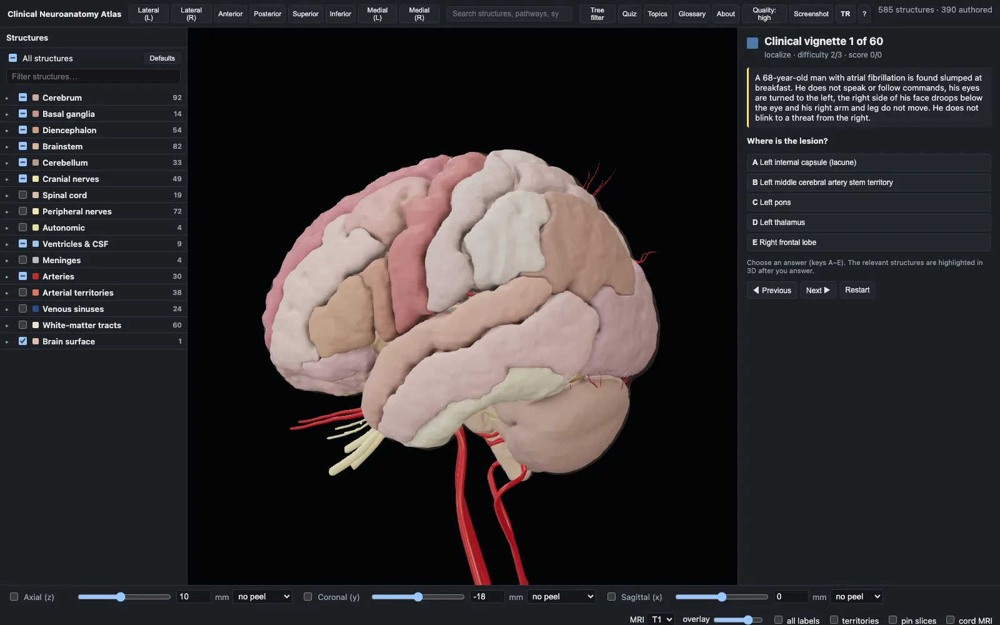
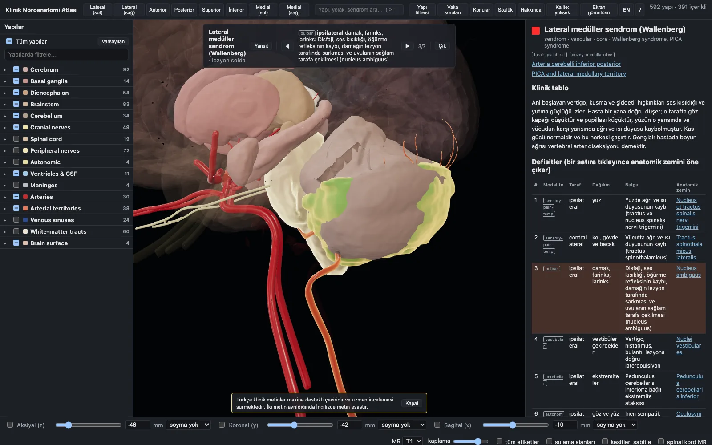

# Clinical Neuroanatomy Atlas

A browser-based 3D atlas of clinical neuroanatomy: 592 meshes, synchronised MRI slices, arterial territories, traced pathways, a lesion mode that shows you what a syndrome does and why, plus clinical topics, a glossary and a quiz. Everything lives in one coordinate frame — MNI152NLin2009cAsym RAS millimetres — so the surfaces, the T1/T2 slices and the label overlays line up exactly, and below the foramen magnum the slices continue into a spinal cord MRI reformatted along the atlas's own cord. The text is original, and every entry cites open-access sources that anyone can read for free. It runs locally, from static files, with no server and no account.

> **Not for clinical use.** This is an educational reference. Its structures are group-average templates and a registered specimen, not any patient's anatomy; its syndrome, imaging and management text is a teaching summary written from the cited sources and may be incomplete, out of date or wrong. Nothing in it is medical advice, and it must not be used to diagnose, treat or make decisions about a patient. Clinical decisions belong to qualified clinicians using current guidelines and the patient's own findings and imaging.



## What it looks like

| | |
|---|---|
|  |  |
| **Slices and 3D in one frame.** Click the MRI to select a structure, or a structure to move the slices. | **Lesion mode.** A syndrome dims the scene to what it involves and steps through its deficits. |
|  |  |
| **Pathways.** Neuron chain, where it crosses, and every station as a clickable waypoint. | **Cranial nerves.** Nuclei, course, branches, reflexes, bedside tests and localising signs. |
|  |  |
| **Quiz.** 60 original vignettes; answering spotlights the structures in 3D. | **Turkish.** The whole interface and all the clinical prose, structures named in Latin. |

## What is in it

| Kind | Count | Notes |
|---|---|---|
| Structures | 379 | deep cerebral veins, cord segments, lobes and gyri, hippocampal subfields, basal forebrain, thalamic and hypothalamic nuclei, brainstem nuclei, cerebellar lobules, white-matter tracts, arterial territories, ventricles, meninges, arteries, peripheral and cutaneous nerves, autonomic |
| Cranial nerves | 12 | nuclei, course, branches, reflexes, bedside tests, localising signs |
| Pathways | 25 | neuron chain, decussation, clickable waypoints, lesion effects by level |
| Syndromes | 125 | localisation, deficits with substrates, crossing logic, imaging, mimics, management pearls |
| Topics | 19 | development, CSF and the blood–brain barrier, neurotransmitters, sleep and EEG, epilepsy, headache, dementia, movement disorders, neuromuscular patterns, paediatric syndromes, localisation, imaging, stroke, infection, tumours, leukodystrophies, nerve injury, cortical layers, coma |
| Glossary | 205 | |
| Quiz | 60 | original vignettes; the answer spotlights the structures in 3D |
| Meshes | 592 public / 662 private | MNI atlases remeshed from label masks, the VENAT venous atlas, BodyParts3D and Z-Anatomy geometry registered by landmarks, and meshes constructed here from geometry no atlas provides (12 in both editions, 40 in the public one); 36 MB at full detail, about 3.5 MB on first paint |
| Citations | 2387 | to 657 open-access sources, across all 825 entries |

## Features

- **One coordinate frame.** Meshes, T1/T2 volumes, label volumes and the cord MRI are all MNI152NLin2009cAsym RAS mm, so nothing has to be lined up by eye.
- **Tree, search and selection.** Tri-state checkboxes per system and subsystem, an all-structures master switch, Alt-click to solo a group, and a search over structures, pathways and syndromes (`>` for syndromes only).
- **3D view.** Orbit, pan and zoom toward the cursor; click a mesh or the MRI slice to select, double-click to frame it; eight camera presets on keys `1`–`8`. Physically based materials with an anatomical palette, and a **Quality** switch for ambient occlusion, soft shadows and anti-aliasing.
- **Slices.** Axial, coronal and sagittal with T1/T2, peel modes, arterial-territory tint, label outlines and an "all labels" paint; the cord MRI switches itself on as soon as a slice reaches the foramen magnum, names the spinal level under the cursor and lets you click one to select that cord segment.
- **Syndrome mode.** `#/syndrome/<id>` dims the scene, highlights the involved structures, places the lesion marker and steps through the deficits; **Mirror** moves the lesion to the other side.
- **Two languages.** English and Turkish, switched with the **TR / EN** button or `L`, kept in the URL so a link opens in the language it was copied in.
- **Everything addressable.** `#/structure/<id>`, `#/pathway/<id>`, `#/syndrome/<id>?step=n&side=l`, `#/topic/<id>`, `#/glossary`, `#/quiz`, `#/about`. Press `?` for the shortcuts.

## Quick start

```bash
git clone <this repo> && cd nervous-system-atlas
npm ci
npm run dev            # http://localhost:5173
```

That serves the app, but a fresh clone has **no data**: the meshes, MRI volumes, label tables and `manifest.json` under `public/data/` are built by the Python pipeline from openly licensed source atlases and are far too large to commit. To build them:

```bash
cd pipeline && uv sync && cd ..
uv run --project pipeline atlas-build      # download → volumes → meshes → labels → manifest → QA
node scripts/check-data.ts                 # integrity check over what was produced
npm run content                            # bundle content/ into public/data/content.json
npm run dev
```

This downloads several GB and takes a while. [Building the data](docs/pipeline.md) explains the steps, the optional extras and what each one needs.

To produce a publishable build:

```bash
npm run build          # the public edition into dist/, with the redistribution gate as its last step
npm run check-tree     # and the repository guard, which needs no data at all
```

## The two editions

The atlas is built twice from the same tree.

The **public edition** is what may be redistributed — Apache-2.0 code, CC BY-SA 4.0 data and content — and it is the default everywhere: `npm run dev` serves it, `npm run build` builds it into `dist/`, and `scripts/check-public.ts` gates that build before you can publish it. The **private edition** additionally contains four datasets whose licence is non-commercial or forbids passing derived files on, so it never leaves the machine that built it: `npm run dev:private`, `npm run build:private`.

| Dataset | Licence | Why it cannot ship | Replaced in the public edition by |
|---|---|---|---|
| Harvard-Oxford (FSL) | `FSL-NC` | non-commercial only | CerebrA/DKT cortical parcels (CC0) |
| Diedrichsen cerebellar atlas | `CC-BY-NC-3.0` | non-commercial only | a FastSurfer CerebNet segmentation of our own template (CC BY-SA 4.0) |
| Brainstem Navigator 7 T nuclei | `BrainstemNavigator-NC-ND` | derived files may not leave the organisation | the Dahl locus coeruleus meta-mask (CC BY 4.0) and landmark-anchored markers built from published volumes |
| PAM50 cord template | `PAM50-unlicensed` | the repository ships no licence at all | a cord MRI composed here from spine-generic and Fudan whole-spine data (CC BY 4.0) |

Nothing is special-cased by name: a dataset leaves the public edition when its licence record carries `nc: true` or `no_redistribution: true`. Those four sit in the `restricted` download group, which `atlas-download` fetches only on the `private` branch or with `ATLAS_ALLOW_RESTRICTED=1`, so a plain clone of this branch cannot build data it may not share. That leaves the public edition 202 meshes short of the private one and puts 132 replacements back, for 592 against 662.

The substitutions are worth reading about — none of them is a like-for-like copy, and the reasoning for each is in [The two editions](docs/editions.md).

## Content and citations

The prose is original, written entry by entry, and **every non-glossary entry cites open-access sources only**: StatPearls chapters on the NCBI Bookshelf, articles in PubMed Central, openly licensed reference pages. No printed textbook is cited anywhere in the shipped atlas, and no paywalled article. Today that is **2387 citations over 657 sources**, and a citation names the section it came from, read from the live chapter rather than guessed.

`verified: true` on a bibliography entry is only ever written by a tool from live source metadata, never by hand. The build fails on an unknown reference, and `npm run citations:check` fails on a malformed citation, an unverified entry or an entry nothing cites. See [Content and citations](docs/content.md) for the schemas, the authoring tools and the rules.

## Turkish edition

The interface exists in English and Turkish (`src/i18n/en.ts` and `src/i18n/tr.ts`, 293 strings, the Turkish table typed against the English one so a missing key fails the typecheck). In Turkish mode structures, cranial nerves and pathways are named the way Turkish medical teaching names them — by their Latin term, from FIPAT's *Terminologia Neuroanatomica* and *Terminologia Anatomica 2* — with the English name as a secondary line.

All 825 entries' clinical prose is translated too, as overlays under `content/i18n/tr/` that pin a hash of the English text they were made from, so an English edit shows up as stale rather than as silently wrong Turkish.

> **The Turkish clinical prose is a machine-assisted translation and is still under specialist review.** It reads as clinical Turkish and has been checked mechanically and for terminology, but it has not yet been reviewed by a Turkish neurologist. Where the two texts differ, the English is the reference. The app says so in Turkish mode, and an entry whose translation is missing or stale carries an *English* tag instead.

[The Turkish edition](docs/turkish-edition.md) covers the terminology table, the overlay format and the tooling.

## Checks

```bash
npm run check-tree                                # nothing private, restricted or generated is committed
npm run typecheck
npm test                                          # 47 unit tests
npm run content:validate                          # schemas, cross-links, word minimums, spelling, coverage
npm run citations:check
node scripts/check-data.ts --all                  # both manifests: meshes, volumes, coordinates
npm run notice -- --check                         # NOTICE is generated; never edit it by hand
uv run --project pipeline atlas-qa                # the pipeline's own data gates
npx playwright install chromium && npm run e2e    # 15 browser smoke tests
npm run build                                     # the public build, ending in the redistribution gate
python3 tools/i18n/prose.py check                 # the Turkish overlays against the English entries
```

`.github/workflows/checks.yml` runs everything in that list that works without generated data. The rest is a local job before a release. [CONTRIBUTING.md](CONTRIBUTING.md) explains the workflow, and [CHANGELOG.md](CHANGELOG.md) what has changed.

## Licences and attribution

| What | Licence | File |
|---|---|---|
| Code (`src/`, `scripts/`, `pipeline/`, `tools/`, `blender/`) | Apache License 2.0 | [LICENSE](LICENSE) |
| Authored content (`content/`) | CC BY-SA 4.0 | [content/LICENSE](content/LICENSE) |
| Generated data (`public/data/`) | CC BY-SA 4.0 | written by the pipeline into `public/data/LICENSE` |

The prose is original. The meshes and volumes are **derivatives** of the third-party datasets listed in [NOTICE](NOTICE), used under their own licences, with changes: registration into MNI152NLin2009cAsym space, remeshing of the label masks through a signed-distance field, smoothing, decimation to per-class triangle budgets, welding of neighbouring parcels, relabelling and recolouring, and the construction of meshes no source atlas provides. Each source licence keeps applying to what is derived from it, alongside CC BY-SA 4.0.

`NOTICE` is generated, never edited by hand — one block per dataset with its citation, licence and download URLs — and `npm run notice -- --check` fails if it is stale. Verbatim licence texts ship with the data in `public/data/licenses/`. In the app, **About** (or `#/about`) lists every source in the loaded build with its licence, its citation and a link to the full text.

**How to cite:** Ayci B. *Clinical Neuroanatomy Atlas*, v1.0.0, 2026. Code Apache 2.0, data and content CC BY-SA 4.0, derived from the datasets in `NOTICE`. Cite the source datasets themselves when you use the meshes, and the open-access references in `content/bibliography/` for the text.

## Known limitations

- **The Turkish clinical prose has not been reviewed by a clinician** (see above). The English text is the reference.
- **The atlas is a template, not a patient.** Group-average parcellations and one registered specimen; nothing in it is a measurement of an individual.
- **The public edition's brainstem nuclei are location markers**, not delineations: ellipsoids of the published volume placed against open landmarks, because no openly licensed 7 T nucleus atlas exists to copy. They are honest about their own construction in the panel and in `manifest.derived`.
- **Some structures have no mesh in either edition.** The thalamostriate vein is not separable from the internal cerebral vein in the venous atlas, and a handful of entries are text-only for the same kind of reason.
- **Twelve meshes are constructed, not segmented** — the phrenic nerves, cord segment blocks, the lumbosacral trunk, the fourth-ventricle choroid plexus — and are flagged as schematic wherever they appear.
- **General neuron and glial biology is covered only where it touches a topic** (transmitters, nerve injury, cortical layers).
- **No mobile layout.** The three-column desktop layout is what exists; it degrades but is not designed for a phone.

## Roadmap

- A Turkish neurologist's review of the translated prose, entry by entry.
- A licence for the PAM50 template. `pipeline/raw/pam50/LICENSE_REQUEST_DRAFT.txt` is a drafted, unsent request; if the authors state one, the private cord MRI, the measured cord segments and the PAM50-cut filum could all ship publicly and the two editions would differ by that much less.
- More of the peripheral nervous system: the current coverage is the clinically load-bearing nerves, not a complete peripheral atlas.
- A responsive layout for tablets.
- Deep links into a specific slice and camera, so a teaching link can open exactly one view.

## Contributing, security and contact

Pull requests are welcome — read [CONTRIBUTING.md](CONTRIBUTING.md) first, especially the two-branch layout and what must never be committed. Licence, redistribution or data-integrity concerns go to the address in [SECURITY.md](SECURITY.md) rather than a public issue. Clinically wrong or dangerous content is an ordinary issue, and a welcome one.
