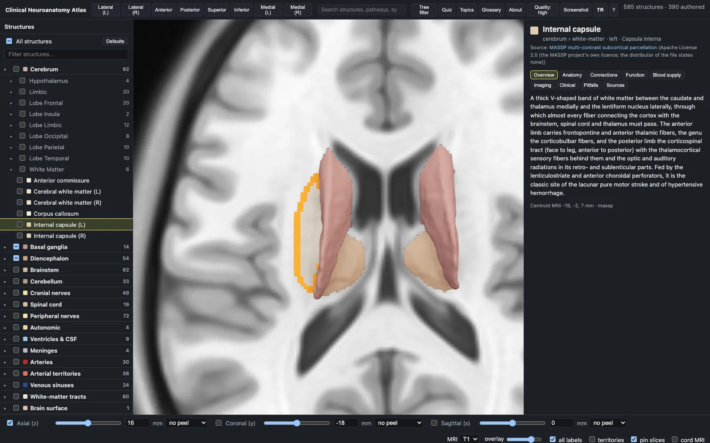
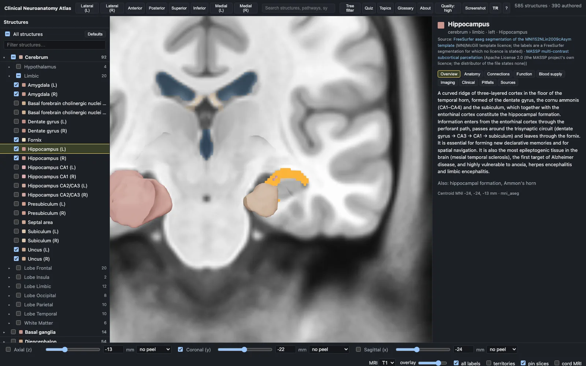
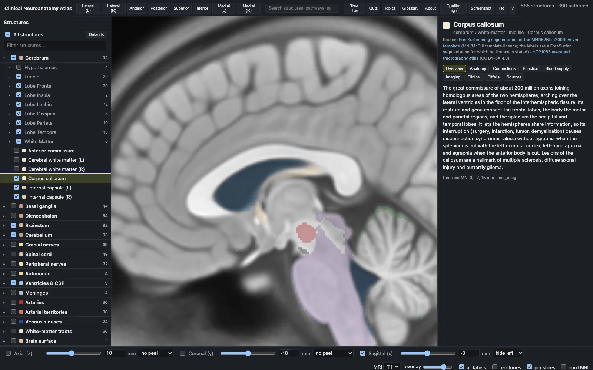
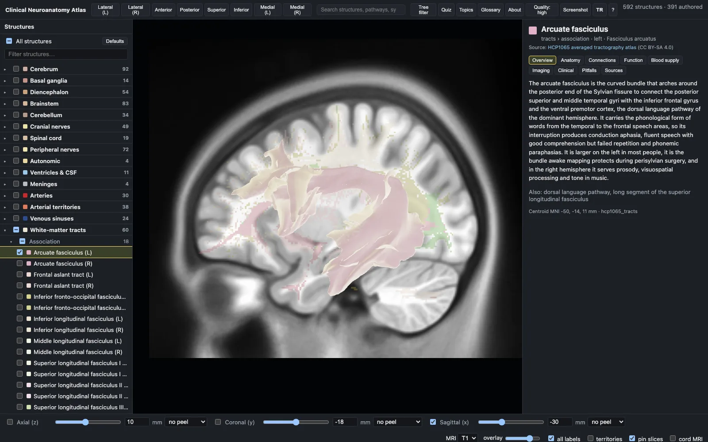
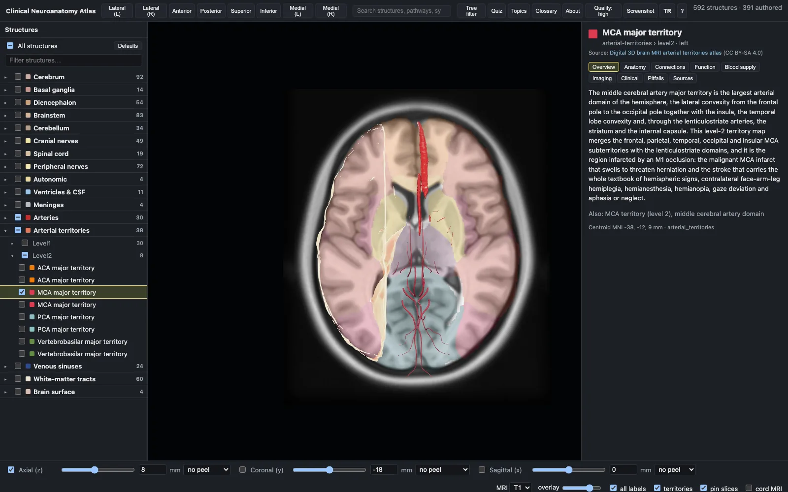
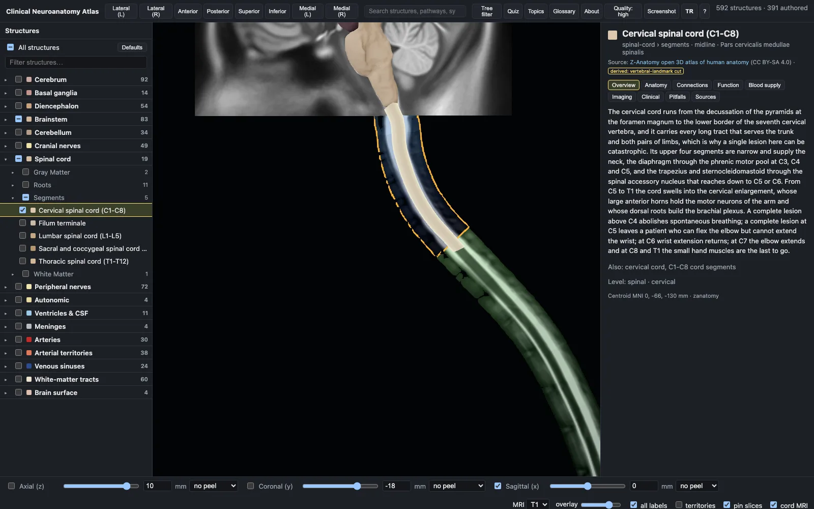
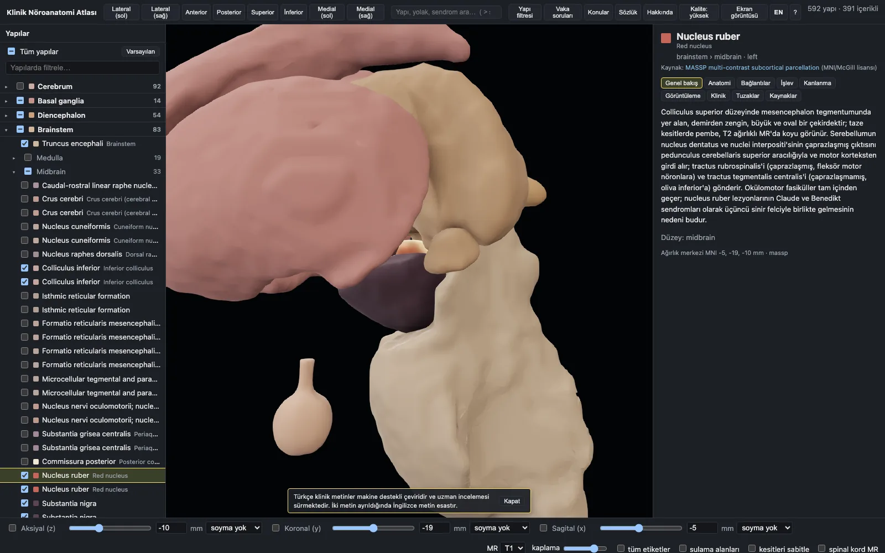

# Clinical Neuroanatomy Atlas

**English** · [Türkçe](#klinik-nöroanatomi-atlası)

A browser-based 3D atlas of clinical neuroanatomy: 592 meshes, synchronised MRI slices, arterial territories, traced pathways, a lesion mode that shows you what a syndrome does and why, plus clinical topics, a glossary and a quiz. Everything lives in one coordinate frame — MNI152NLin2009cAsym RAS millimetres — so the surfaces, the T1/T2 slices and the label overlays line up exactly, and below the foramen magnum the slices continue into a spinal cord MRI reformatted along the atlas's own cord. Every entry cites open-access sources that anyone can read for free. It runs locally, from static files, with no server and no account.

**[Open the live demo →](https://aycibatuhan.github.io/nervous-system-atlas/)**  — the same public edition, nothing to install.

> **Not for clinical use.** This is an educational reference. Its structures are group-average templates and a registered specimen, not any patient's anatomy; its syndrome, imaging and management text is a teaching summary written from the cited sources and may be incomplete, out of date or wrong. Nothing in it is medical advice, and it must not be used to diagnose, treat or make decisions about a patient. Clinical decisions belong to qualified clinicians using current guidelines and the patient's own findings and imaging.


## What it looks like

| | |
|---|---|
|  |  |
| **Slices and 3D in one frame.** Click the MRI to select a structure, or a structure to move the slices. | **Lesion mode.** A syndrome dims the scene to what it involves and steps through its deficits. |
|  |  |
| **Pathways.** Neuron chain, where it crosses, and every station as a clickable waypoint. | **Cranial nerves.** Nuclei, course, branches, reflexes, bedside tests and localising signs. |
|  |  |
| **Quiz.** 60 original vignettes; answering spotlights the structures in 3D. | **Turkish.** The whole interface and all the clinical prose, structures named in Latin. |

## Sections, tracts and territories

Every slice is the same MRI the meshes are registered to, so a structure can be read on the section and in
three dimensions at once. Click the slice to select what is under the cursor, or click a structure to move the
slices to it.

| | |
|---|---|
|  |  |
| **Axial, through the internal capsule.** The label overlay paints the deep grey nuclei on the MRI; the selected structure is outlined. | **Coronal, at the hippocampus.** The temporal horn, the hippocampi and the amygdalae on the section that shows them. |
|  |  |
| **Sagittal, hemisected.** Peel mode hides everything on one side of the plane, so you look at the cut surface with the MRI behind it. | **Tracts.** Sixty white-matter bundles from the HCP1065 atlas, in 3D and painted on the slice. |
|  |  |
| **Arterial territories.** The territory tint answers "which vessel would do this?" on the section itself. | **The cord.** Below the foramen magnum the slices continue into a cord MRI reformatted along the atlas's own cord, with the spinal levels painted. |

## What is in it

| Kind | Count | Notes |
|---|---|---|
| Structures | 379 | deep cerebral veins, cord segments, lobes and gyri, hippocampal subfields, basal forebrain, thalamic and hypothalamic nuclei, brainstem nuclei, cerebellar lobules, white-matter tracts, arterial territories, ventricles, meninges, arteries, peripheral and cutaneous nerves, autonomic |
| Cranial nerves | 12 | nuclei, course, branches, reflexes, bedside tests, localising signs |
| Pathways | 25 | neuron chain, decussation, clickable waypoints, lesion effects by level |
| Syndromes | 125 | localisation, deficits with substrates, crossing logic, imaging, mimics, management pearls |
| Topics | 19 | development, CSF and the blood–brain barrier, neurotransmitters, sleep and EEG, epilepsy, headache, dementia, movement disorders, neuromuscular patterns, paediatric syndromes, localisation, imaging, stroke, infection, tumours, leukodystrophies, nerve injury, cortical layers, coma |
| Glossary | 205 | |
| Quiz | 60 | original vignettes; the answer spotlights the structures in 3D |
| Meshes | 592 public / 662 private | MNI atlases remeshed from label masks, the VENAT venous atlas, BodyParts3D and Z-Anatomy geometry registered by landmarks, and meshes constructed here from geometry no atlas provides (12 in both editions, 40 in the public one); 36 MB at full detail, about 3.5 MB on first paint |
| Citations | 2387 | to 657 open-access sources, across all 825 entries |

## Features

- **One coordinate frame.** Meshes, T1/T2 volumes, label volumes and the cord MRI are all MNI152NLin2009cAsym RAS mm.
- **Tree, search and selection.** Tri-state checkboxes per system and subsystem, an all-structures master switch, Alt-click to solo a group, and a search over structures, pathways and syndromes (`>` for syndromes only).
- **3D view.** Orbit, pan and zoom toward the cursor; click a mesh or the MRI slice to select, double-click to frame it; eight camera presets on keys `1`–`8`. Physically based materials with an anatomical palette, and a **Quality** switch for ambient occlusion, soft shadows and anti-aliasing.
- **Slices.** Axial, coronal and sagittal with T1/T2, peel modes, arterial-territory tint, label outlines and an "all labels" paint; the cord MRI switches itself on as soon as a slice reaches the foramen magnum, names the spinal level under the cursor and lets you click one to select that cord segment.
- **Syndrome mode.** `#/syndrome/<id>` dims the scene, highlights the involved structures, places the lesion marker and steps through the deficits; **Mirror** moves the lesion to the other side.
- **Two languages.** English and Turkish, switched with the **TR / EN** button or `L`, kept in the URL so a link opens in the language it was copied in.
- **Everything addressable.** `#/structure/<id>`, `#/pathway/<id>`, `#/syndrome/<id>?step=n&side=l`, `#/topic/<id>`, `#/glossary`, `#/quiz`, `#/about`. Press `?` for the shortcuts.

## Quick start

**The atlas data is not in this repository.** The meshes, the MRI volumes and the label tables under
`public/data/` are 63 MB of generated files, far too large to commit, so they ship as a release asset instead.
A clone fetches them once — that is what `npm run data` below is for.

```bash
git clone https://github.com/aycibatuhan/nervous-system-atlas.git && cd nervous-system-atlas
npm ci
npm run data           # fetches the data bundle (49 MB) into public/data/
npm run dev            # http://localhost:5173
```

`npm run data` downloads the prebuilt public edition from the
[v1.0.0 release](https://github.com/aycibatuhan/nervous-system-atlas/releases/tag/v1.0.0), checks it against a
SHA-256 pinned in the repository before unpacking anything, and will not overwrite data you already have unless
you pass `--force`. Run the app without it and you get a message on the canvas saying so, not a broken page.

To produce a publishable build:

```bash
npm run build          # the public edition into dist/, with the redistribution gate as its last step
npm run check-tree     # and the repository guard, which needs no data at all
```

### Building the data instead of downloading it

The release bundle is generated; you can generate it yourself from the source atlases, which is also what you
need if you want to change how the meshes are made:

```bash
cd pipeline && uv sync && cd ..
uv run --project pipeline atlas-build      # download → volumes → meshes → labels → manifest → QA
node scripts/check-data.ts                 # integrity check over what was produced
npm run content                            # bundle content/ into public/data/content.json
npm run dev
```

This downloads several GB and takes a while. [Building the data](docs/pipeline.md) explains the steps, the
optional extras and what each one needs. Obtaining the four restricted datasets of the full edition is covered
in [the two editions](docs/editions.md).

## The two editions

The atlas is built twice from the same tree.

The **public edition** is what may be redistributed — Apache-2.0 code, CC BY-SA 4.0 data and content — and it is the default everywhere: `npm run dev` serves it, `npm run build` builds it into `dist/`, and `scripts/check-public.ts` gates that build before you can publish it. The **private edition** additionally contains four datasets whose licence is non-commercial or forbids passing derived files on, so it never leaves the machine that built it: `npm run dev:private`, `npm run build:private`.

| Dataset | Licence | Why it cannot ship | Replaced in the public edition by |
|---|---|---|---|
| Harvard-Oxford (FSL) | `FSL-NC` | held back pending review — FSL relicensed it to CC BY-SA 4.0 in Aug 2025 | CerebrA/DKT cortical parcels (CC0) |
| Diedrichsen cerebellar atlas | `CC-BY-ND` | no derivatives may be distributed | a FastSurfer CerebNet segmentation of our own template (CC BY-SA 4.0) |
| Brainstem Navigator 7 T nuclei | `BrainstemNavigator-NC-ND` | derived files may not leave the organisation | the Dahl locus coeruleus meta-mask (CC BY 4.0) and landmark-anchored markers built from published volumes |
| PAM50 cord template | `PAM50-unlicensed` | the repository ships no licence at all | a cord MRI composed here from spine-generic and Fudan whole-spine data (CC BY 4.0) |

Nothing is special-cased by name: a dataset leaves the public edition when its licence record carries `nc: true` or `no_redistribution: true`. Those four sit in the `restricted` download group, which `atlas-download` fetches only on the `private` branch or with `ATLAS_ALLOW_RESTRICTED=1`, so a plain clone of this branch cannot build data it may not share. That leaves the public edition 202 meshes short of the private one and puts 132 replacements back, for 592 against 662.

The substitutions are worth reading about — none of them is a like-for-like copy, and the reasoning for each is in [The two editions](docs/editions.md).

## Content and citations

**Every non-glossary entry cites open-access sources only**: StatPearls chapters on the NCBI Bookshelf, articles in PubMed Central, openly licensed reference pages. No printed textbook is cited anywhere in the shipped atlas, and no paywalled article. Today that is **2387 citations over 657 sources**, and a citation names the section it came from, read from the live chapter.

`verified: true` on a bibliography entry is only ever written by a tool from live source metadata, never by hand. The build fails on an unknown reference, and `npm run citations:check` fails on a malformed citation, an unverified entry or an entry nothing cites. See [Content and citations](docs/content.md) for the schemas, the authoring tools and the rules.

## Turkish edition

The interface exists in English and Turkish (`src/i18n/en.ts` and `src/i18n/tr.ts`, 293 strings, the Turkish table typed against the English one so a missing key fails the typecheck). In Turkish mode structures, cranial nerves and pathways are named the way Turkish medical teaching names them — by their Latin term, from FIPAT's *Terminologia Neuroanatomica* and *Terminologia Anatomica 2* — with the English name as a secondary line.

All 825 entries' clinical prose is translated too, as overlays under `content/i18n/tr/` that pin a hash of the English text they were made from, so an English edit shows up as stale rather than as silently wrong Turkish.



> **The Turkish clinical prose is a machine-assisted translation and is still under specialist review.** It has been checked mechanically and for terminology, but not by a Turkish neurologist. Where the two texts differ, the English is the reference. The app says so in Turkish mode, and an entry whose translation is missing or stale carries an *English* tag instead.

[The Turkish edition](docs/turkish-edition.md) covers the terminology table, the overlay format and the tooling.

## Checks

```bash
npm run check-tree                                # nothing private, restricted or generated is committed
npm run typecheck
npm test                                          # 47 unit tests
npm run content:validate                          # schemas, cross-links, word minimums, spelling, coverage
npm run citations:check
node scripts/check-data.ts --all                  # both manifests: meshes, volumes, coordinates
npm run notice -- --check                         # NOTICE is generated; never edit it by hand
uv run --project pipeline atlas-qa                # the pipeline's own data gates
npx playwright install chromium && npm run e2e    # 19 browser tests (4 of them need no data)
npm run build                                     # the public build, ending in the redistribution gate
python3 tools/i18n/prose.py check                 # the Turkish overlays against the English entries
```

`.github/workflows/checks.yml` runs everything in that list that works without generated data. The rest is a local job before a release. [CONTRIBUTING.md](CONTRIBUTING.md) explains the workflow, and [CHANGELOG.md](CHANGELOG.md) what has changed.

## Licences and attribution

| What | Licence | File |
|---|---|---|
| Code (`src/`, `scripts/`, `pipeline/`, `tools/`, `blender/`) | Apache License 2.0 | [LICENSE](LICENSE) |
| Authored content (`content/`) | CC BY-SA 4.0 | [content/LICENSE](content/LICENSE) |
| Generated data (`public/data/`) | CC BY-SA 4.0 | written by the pipeline into `public/data/LICENSE` |

The meshes and volumes are **derivatives** of the third-party datasets listed in [NOTICE](NOTICE), used under their own licences, with changes: registration into MNI152NLin2009cAsym space, remeshing of the label masks through a signed-distance field, smoothing, decimation to per-class triangle budgets, welding of neighbouring parcels, relabelling and recolouring, and the construction of meshes no source atlas provides. Each source licence keeps applying to what is derived from it, alongside CC BY-SA 4.0.

`NOTICE` is generated, never edited by hand — one block per dataset with its citation, licence and download URLs — and `npm run notice -- --check` fails if it is stale. Verbatim licence texts ship with the data in `public/data/licenses/`. In the app, **About** (or `#/about`) lists every source in the loaded build with its licence, its citation and a link to the full text.

**How to cite:** Ayci B. *Clinical Neuroanatomy Atlas*, v1.0.0, 2026. Code Apache 2.0, data and content CC BY-SA 4.0, derived from the datasets in `NOTICE`. Cite the source datasets themselves when you use the meshes, and the open-access references in `content/bibliography/` for the text.

## Known limitations

- **The Turkish clinical prose has not been reviewed by a clinician** (see above). The English text is the reference.
- **The atlas is a template, not a patient.** Group-average parcellations and one registered specimen; nothing in it is a measurement of an individual.
- **The public edition's brainstem nuclei are location markers**, not delineations: ellipsoids of the published volume placed against open landmarks, because no openly licensed 7 T nucleus atlas exists to copy. They are honest about their own construction in the panel and in `manifest.derived`.
- **Some structures have no mesh in either edition.** The thalamostriate vein is not separable from the internal cerebral vein in the venous atlas, and a handful of entries are text-only for the same kind of reason.
- **Twelve meshes are constructed, not segmented** — the phrenic nerves, cord segment blocks, the lumbosacral trunk, the fourth-ventricle choroid plexus — and are flagged as schematic wherever they appear.
- **General neuron and glial biology is covered only where it touches a topic** (transmitters, nerve injury, cortical layers).
- **Built for a desktop window.** Below 1100px the panels narrow, and below 900px they float over the 3D view and start closed, so the atlas stays usable on a tablet or a half-width window — but the three-column layout is still what it is designed around, and a phone gets a workable 3D view rather than a phone interface.

## Roadmap

- A Turkish neurologist's review of the translated prose, entry by entry.
- A licence for the PAM50 template. `pipeline/raw/pam50/LICENSE_REQUEST_DRAFT.txt` is a drafted, unsent request; if the authors state one, the private cord MRI, the measured cord segments and the PAM50-cut filum could all ship publicly and the two editions would differ by that much less.
- More of the peripheral nervous system: the current coverage is the clinically load-bearing nerves, not a complete peripheral atlas.
- A layout designed for phones, rather than the desktop one degrading gracefully.
- Deep links into a specific slice and camera, so a teaching link can open exactly one view.

## Contributing, security and contact

Pull requests are welcome — read [CONTRIBUTING.md](CONTRIBUTING.md) first, especially the two-branch layout and what must never be committed. Licence, redistribution or data-integrity concerns go to the address in [SECURITY.md](SECURITY.md) rather than a public issue. Clinically wrong or dangerous content is an ordinary issue, and a welcome one.

---

<a id="klinik-nöroanatomi-atlası"></a>

# Klinik Nöroanatomi Atlası

*(This is the Turkish version of the document above. [Back to English](#clinical-neuroanatomy-atlas).)*

Tarayıcıda çalışan üç boyutlu bir klinik nöroanatomi atlası: 592 mesh, eşzamanlı MR kesitleri, arter sulama alanları, izlenebilir yolaklar, bir sendromun neyi nasıl bozduğunu gösteren lezyon kipi, klinik konular, bir sözlük ve vaka soruları. Her şey tek bir koordinat çerçevesindedir (MNI152NLin2009cAsym RAS milimetre), bu yüzden yüzeyler, T1/T2 kesitleri ve etiket kaplamaları tam olarak çakışır; foramen magnumun altında kesitler, atlasın kendi omuriliği boyunca yeniden biçimlenmiş bir spinal kord MR'ına devam eder. Her kayıt, herkesin ücretsiz okuyabileceği açık erişimli kaynaklara atıf verir. Uygulama yerelde, statik dosyalardan çalışır; sunucu da hesap da gerektirmez.

**[Canlı demoyu açın →](https://aycibatuhan.github.io/nervous-system-atlas/)**  — aynı genel sürüm, hiçbir kurulum gerekmez.

> **Klinik kullanım için değildir.** Bu atlas eğitim amaçlı bir başvuru kaynağıdır. İçindeki yapılar grup ortalaması şablonlar ve kayıtlanmış bir örnektir, hiçbir hastanın kendi anatomisi değildir; sendrom, görüntüleme ve tedavi metinleri ise belirtilen kaynaklardan yazılmış öğretim özetleridir ve eksik, güncelliğini yitirmiş ya da yanlış olabilir. Buradaki hiçbir bilgi tıbbi tavsiye değildir; hastaya tanı koymak, tedavi vermek ya da hastayla ilgili karar almak için kullanmayın. Bu kararlar, güncel kılavuzları ve hastanın kendi bulgularını ve görüntülerini kullanan yetkin hekimlere aittir.


## Nasıl görünüyor

| | |
|---|---|
|  |  |
| **Kesit ve üç boyut aynı çerçevede.** MR'a tıklayarak yapıyı seçin ya da bir yapıya tıklayarak kesitleri oraya taşıyın. | **Lezyon kipi.** Sendrom, sahneyi tuttuğu yapılara indirger ve defisitleri sırayla gösterir. |
|  |  |
| **Yolaklar.** Nöron zinciri, nerede çaprazlaştığı ve her durağı tıklanabilir bir ara nokta olarak. | **Kranial sinirler.** Çekirdekler, seyir, dallar, refleksler, yatak başı testler ve lokalize edici bulgular. |
|  |  |
| **Vaka soruları.** 60 özgün vaka; yanıtlayınca ilgili yapılar üç boyutta öne çıkar. | **Türkçe.** Arayüzün tamamı ve bütün klinik metinler, yapı adları Latince. |

## Kesitler, traktuslar ve sulama alanları

Her kesit, meshlerin kayıtlandığı MR'ın kendisidir; böylece bir yapı hem kesitte hem üç boyutta aynı anda okunur. Kesite tıklayınca imlecin altındaki yapı seçilir, bir yapıya tıklayınca kesitler ona taşınır.

| | |
|---|---|
|  |  |
| **Aksiyal, capsula interna düzeyi.** Etiket kaplaması derin gri çekirdekleri MR'ın üzerine boyar; seçili yapı konturlanır. | **Koronal, hippocampus düzeyi.** Cornu temporale, hippocampus ve amygdala, onları gösteren kesitte. |
|  |  |
| **Sagital, hemiseksiyon.** Soyma kipi düzlemin bir yanındaki her şeyi gizler; kesit yüzeyine arkadaki MR ile birlikte bakarsınız. | **Traktuslar.** HCP1065 atlasından altmış ak madde demeti, üç boyutta ve kesitin üzerinde boyalı. |
|  |  |
| **Sulama alanları.** "Hangi damar bunu yapardı?" sorusunu kesitin kendisinde yanıtlar. | **Omurilik.** Foramen magnumun altında kesitler, atlasın kendi kordonu boyunca yeniden biçimlenmiş bir kord MR'ına devam eder; spinal düzeyler boyanmıştır. |

## İçindekiler

| Tür | Sayı | Not |
|---|---|---|
| Yapılar | 379 | derin serebral venler, kord segmentleri, loblar ve giruslar, hippokampal alt alanlar, bazal ön beyin, talamik ve hipotalamik çekirdekler, beyin sapı çekirdekleri, serebellar lobüller, ak madde traktusları, arter sulama alanları, ventriküller, meninksler, arterler, periferik ve kutanöz sinirler, otonom yapılar |
| Kranial sinirler | 12 | çekirdekler, seyir, dallar, refleksler, yatak başı testler, lokalize edici bulgular |
| Yolaklar | 25 | nöron zinciri, çaprazlaşma, tıklanabilir ara noktalar, düzeye göre lezyon etkileri |
| Sendromlar | 125 | lokalizasyon, anatomik zeminiyle defisitler, taraf mantığı, görüntüleme, ayırıcı tanılar, tedavi incileri |
| Konular | 19 | gelişim, BOS ve kan-beyin bariyeri, nörotransmitterler, uyku ve EEG, epilepsi, baş ağrısı, demans, hareket bozuklukları, nöromusküler desenler, pediatrik sendromlar, lokalizasyon, görüntüleme, inme, enfeksiyon, tümörler, lökodistrofiler, sinir hasarı, kortikal katmanlar, koma |
| Sözlük | 205 | |
| Vaka soruları | 60 | özgün vakalar; yanıt, ilgili yapıları üç boyutta öne çıkarır |
| Mesh | 592 açık / 662 özel | etiket maskelerinden yeniden meshlenen MNI atlasları, VENAT venöz atlası, işaret noktalarıyla kayıtlanan BodyParts3D ve Z-Anatomy geometrisi ve hiçbir atlasın vermediği, burada kurulan meshler (iki sürümde de 12, açık sürümde 40); tam ayrıntıda 36 MB, ilk boyamada yaklaşık 3,5 MB |
| Atıflar | 2387 | 825 kaydın tamamında, 657 açık erişimli kaynağa |

## Özellikler

- **Tek koordinat çerçevesi.** Meshler, T1/T2 hacimleri, etiket hacimleri ve kord MR'ı hep MNI152NLin2009cAsym RAS mm'dir.
- **Ağaç, arama ve seçim.** Her sistem ve alt sistem için üç durumlu kutular, tüm yapıları açıp kapatan ana anahtar, bir grubu yalnız bırakmak için Alt+tıklama ve yapılar, yolaklar ve sendromlar üzerinde arama (`>` yalnızca sendromlar için).
- **Üç boyutlu görünüm.** Döndürme, kaydırma ve imlece doğru yakınlaşma; bir meshe ya da MR kesitine tıklayarak seçme, çift tıklayarak çerçeveleme; `1`–`8` tuşlarında sekiz kamera ön ayarı. Anatomik paletli fiziksel tabanlı malzemeler ve ortam okluzyonu, yumuşak gölge ve kenar yumuşatma için bir **Kalite** düğmesi.
- **Kesitler.** T1/T2 ile aksiyal, koronal ve sagital; soyma kipleri, sulama alanı renklendirmesi, etiket konturları ve "tüm etiketler" boyaması. Bir kesit foramen magnuma indiği anda kord MR'ı kendiliğinden açılır, imlecin altındaki spinal düzeyi adlandırır ve düzeye tıklayınca o kord segmentini seçer.
- **Lezyon kipi.** `#/syndrome/<id>` sahneyi karartır, tutulan yapıları öne çıkarır, lezyon işaretini yerleştirir ve defisitleri sırayla gezer; **Yansıt** lezyonu diğer tarafa taşır.
- **İki dil.** Araç çubuğundaki **TR / EN** düğmesi ya da `L` ile İngilizce ve Türkçe. Seçim adres çubuğunda tutulur, böylece bir bağlantı kopyalandığı dilde açılır.
- **Her şeyin adresi var.** `#/structure/<id>`, `#/pathway/<id>`, `#/syndrome/<id>?step=n&side=l`, `#/topic/<id>`, `#/glossary`, `#/quiz`, `#/about`. Kısayollar için `?` tuşuna basın.

## Hızlı başlangıç

**Atlas verisi bu depoda değildir.** `public/data/` altındaki yüzey ağları, MR hacimleri ve etiket tabloları
63 MB'lık üretilmiş dosyalardır; depoya konamayacak kadar büyük oldukları için sürüm eki olarak dağıtılır.
Yeni bir kopya bunları bir kez indirir — aşağıdaki `npm run data` bunun içindir.

```bash
git clone https://github.com/aycibatuhan/nervous-system-atlas.git && cd nervous-system-atlas
npm ci
npm run data           # veri paketini (49 MB) public/data/ içine indirir
npm run dev            # http://localhost:5173
```

`npm run data`, hazır genel sürümü
[v1.0.0 sürümünden](https://github.com/aycibatuhan/nervous-system-atlas/releases/tag/v1.0.0) indirir; hiçbir
şeyi açmadan önce depoda sabitlenmiş SHA-256 özetiyle doğrular ve `--force` verilmedikçe mevcut veriyi
üzerine yazmaz. Bu adım atlanırsa uygulama bozuk bir sayfa değil, ne yapılması gerektiğini söyleyen bir ileti
gösterir.

Yayımlanabilir bir derleme için:

```bash
npm run build          # açık sürümü dist/ içine derler, son adımı yeniden dağıtım denetimidir
npm run check-tree     # ve hiç veri gerektirmeyen depo denetimi
```

### Veriyi indirmek yerine üretmek

Sürüm paketi üretilmiş bir çıktıdır; aynısını kaynak atlaslardan kendiniz de üretebilirsiniz. Yüzey ağlarının
nasıl oluşturulduğunu değiştirmek isterseniz zaten bu yol gerekir:

```bash
cd pipeline && uv sync && cd ..
uv run --project pipeline atlas-build      # indirme → hacimler → meshler → etiketler → manifest → QA
node scripts/check-data.ts                 # üretilen verinin bütünlük denetimi
npm run content                            # content/ dizinini public/data/content.json içine paketler
npm run dev
```

Bu adım birkaç GB indirir ve zaman alır. Adımları, isteğe bağlı ekleri ve her birinin neye ihtiyaç duyduğunu
[Verinin üretilmesi](docs/pipeline.md) anlatır. Tam sürümün dört kısıtlı veri kümesinin nasıl edinileceği
[iki sürüm](docs/editions.md) belgesindedir.

## İki sürüm

Atlas aynı ağaçtan iki kez derlenir.

**Açık sürüm** yeniden dağıtılabilen sürümdür (kod Apache-2.0, veri ve içerik CC BY-SA 4.0) ve her yerde varsayılandır: `npm run dev` onu sunar, `npm run build` onu `dist/` içine derler ve `scripts/check-public.ts` yayımlanmadan önce bu derlemeyi denetler. **Özel sürüm** buna ek olarak, lisansı ticari olmayan kullanımla sınırlı ya da türev dosyaların aktarılmasını yasaklayan dört veri kümesini içerir; bu yüzden onu derleyen makineden hiç çıkmaz: `npm run dev:private`, `npm run build:private`.

| Veri kümesi | Lisans | Neden yayımlanamaz | Açık sürümdeki karşılığı |
|---|---|---|---|
| Harvard-Oxford (FSL) | `FSL-NC` | inceleme bekliyor — FSL, Ağustos 2025'te CC BY-SA 4.0'a geçirdi | CerebrA/DKT kortikal parselleri (CC0) |
| Diedrichsen serebellum atlası | `CC-BY-ND` | türev çalışmalar dağıtılamaz | kendi şablonumuzun FastSurfer CerebNet bölütlemesi (CC BY-SA 4.0) |
| Brainstem Navigator 7 T çekirdekleri | `BrainstemNavigator-NC-ND` | türev dosyalar kurum dışına çıkamaz | Dahl locus coeruleus meta-maskesi (CC BY 4.0) ve yayımlanmış hacimlerden kurulan işaret noktası tabanlı belirteçler |
| PAM50 kord şablonu | `PAM50-unlicensed` | deposunda hiçbir lisans yok | burada spine-generic ve Fudan tüm-omurga verisinden birleştirilen bir kord MR'ı (CC BY 4.0) |

Hiçbir şey adına göre ayıklanmaz: bir veri kümesi, lisans kaydında `nc: true` ya da `no_redistribution: true` taşıyorsa açık sürümden çıkar. Bu dördü `restricted` indirme grubundadır; `atlas-download` onları yalnızca `private` dalında ya da `ATLAS_ALLOW_RESTRICTED=1` ile indirir, böylece bu dalın düz bir klonu paylaşamayacağı veriyi üretemez. Sonuçta açık sürüm özel sürümden 202 mesh eksiktir ve yerine 132 karşılık koyar: 592'ye karşı 662.

Karşılıkların hiçbiri birebir kopya değildir; her birinin gerekçesi [İki sürüm](docs/editions.md) içindedir.

## İçerik ve kaynaklar

**Sözlük dışındaki her kayıt yalnızca açık erişimli kaynaklara atıf verir**: NCBI Bookshelf üzerindeki StatPearls bölümleri, PubMed Central'daki makaleler, açık lisanslı başvuru sayfaları. Yayımlanan atlasın hiçbir yerinde basılı ders kitabına ya da ödeme duvarı ardındaki bir makaleye atıf yoktur. Bugün bu, **657 kaynak üzerinden 2387 atıf** demektir ve her atıf, canlı bölümden okunarak geldiği bölümü adlandırır.

Bir kaynakça kaydındaki `verified: true` yalnızca bir araç tarafından, canlı kaynak üstverisinden yazılır; elle asla. Bilinmeyen bir kaynağa atıf derlemeyi durdurur; `npm run citations:check` ise bozuk bir atıfta, doğrulanmamış bir kayıtta ya da hiçbir yerden atıf almayan bir kayıtta hata verir. Şemalar, yazım araçları ve kurallar için [İçerik ve kaynaklar](docs/content.md).

## Türkçe sürüm

Arayüz İngilizce ve Türkçedir (`src/i18n/en.ts` ve `src/i18n/tr.ts`, 293 dizge; Türkçe tablo İngilizcesine göre tiplenmiştir, bu yüzden eksik bir anahtar tip denetimini düşürür). Türkçe kipte yapılar, kranial sinirler ve yolaklar Türk tıp eğitiminin adlandırdığı gibi, FIPAT'ın *Terminologia Neuroanatomica* ve *Terminologia Anatomica 2* listelerinden gelen Latince terimleriyle adlandırılır; İngilizce ad ikinci satırda kalır.

825 kaydın klinik metinlerinin tamamı da çevrilmiştir. Çeviriler `content/i18n/tr/` altında, üretildikleri İngilizce metnin özetine (hash) sabitlenmiş kaplamalar olarak durur; böylece İngilizce metin değiştiğinde çeviri sessizce yanlış kalmak yerine "eskimiş" olarak işaretlenir.


> **Türkçe klinik metinler makine destekli çeviridir ve uzman incelemesi sürmektedir.** Makineyle ve terminoloji açısından denetlenmiştir; bir Türk nöroloğun incelemesinden ise henüz geçmemiştir. İki metin ayrıldığında İngilizce metin esastır. Uygulama bunu Türkçe kipte söyler; çevirisi eksik ya da eskimiş bir kayıt ise *English* etiketi taşır.

Terminoloji tablosunu, kaplama biçimini ve araçları [Türkçe sürüm](docs/turkish-edition.md) anlatır.

## Denetimler

```bash
npm run check-tree                                # özel, kısıtlı ya da üretilmiş hiçbir dosya depoda değil
npm run typecheck
npm test                                          # 47 birim testi
npm run content:validate                          # şemalar, çapraz bağlantılar, sözcük alt sınırları, yazım, kapsam
npm run citations:check
node scripts/check-data.ts --all                  # iki manifest: meshler, hacimler, koordinatlar
npm run notice -- --check                         # NOTICE üretilir; elle düzenlenmez
uv run --project pipeline atlas-qa                # işlem hattının kendi veri kapıları
npx playwright install chromium && npm run e2e    # 19 tarayıcı testi (4'ü veri gerektirmez)
npm run build                                     # açık derleme, sonunda yeniden dağıtım denetimi
python3 tools/i18n/prose.py check                 # Türkçe kaplamaların İngilizce kayıtlarla karşılaştırılması
```

`.github/workflows/checks.yml` bu listeden üretilmiş veri gerektirmeyen her şeyi çalıştırır. Kalanı, sürüm öncesi yerelde yapılır. Çalışma düzenini [CONTRIBUTING.md](CONTRIBUTING.md), neyin değiştiğini [CHANGELOG.md](CHANGELOG.md) anlatır.

## Lisanslar ve atıf

| Ne | Lisans | Dosya |
|---|---|---|
| Kod (`src/`, `scripts/`, `pipeline/`, `tools/`, `blender/`) | Apache License 2.0 | [LICENSE](LICENSE) |
| Yazılmış içerik (`content/`) | CC BY-SA 4.0 | [content/LICENSE](content/LICENSE) |
| Üretilen veri (`public/data/`) | CC BY-SA 4.0 | işlem hattının yazdığı `public/data/LICENSE` |

Meshler ve hacimler, [NOTICE](NOTICE) dosyasında listelenen üçüncü taraf veri kümelerinin, kendi lisansları altında kullanılan **türevleridir**; yapılan değişiklikler: MNI152NLin2009cAsym uzayına kayıtlama, etiket maskelerinin işaretli mesafe alanı üzerinden yeniden meshlenmesi, yumuşatma, sınıf başına üçgen bütçesine indirgeme, komşu parsellerin kaynaştırılması, yeniden etiketleme ve renklendirme ve hiçbir kaynak atlasın vermediği meshlerin kurulması. Her kaynak lisansı, kendisinden türetilene CC BY-SA 4.0 ile birlikte uygulanmaya devam eder.

`NOTICE` üretilir, elle düzenlenmez; her veri kümesi için atıf, lisans ve indirme adresleriyle bir blok içerir ve `npm run notice -- --check` dosya eskidiyse hata verir. Lisans metinlerinin tamamı veriyle birlikte `public/data/licenses/` altında gider. Uygulamada **Hakkında** (ya da `#/about`), yüklü derlemedeki her kaynağı lisansı, atfı ve tam metin bağlantısıyla listeler.

**Nasıl atıf verilir:** Ayci B. *Clinical Neuroanatomy Atlas*, v1.0.0, 2026. Kod Apache 2.0, veri ve içerik CC BY-SA 4.0; `NOTICE` içindeki veri kümelerinden türetilmiştir. Meshleri kullanırken kaynak veri kümelerine, metin için `content/bibliography/` altındaki açık erişimli kaynaklara da atıf verin.

## Bilinen sınırlar

- **Türkçe klinik metinler bir hekim tarafından incelenmemiştir** (yukarıya bakın). Esas metin İngilizcedir.
- **Atlas bir şablondur, bir hasta değil.** Grup ortalaması parselasyonlar ve kayıtlanmış tek bir örnek; içindeki hiçbir şey bir bireyin ölçümü değildir.
- **Açık sürümün beyin sapı çekirdekleri konum belirteçleridir**, bölütleme değil: yayımlanmış hacim kadar elipsoidler, açık işaret noktalarına göre yerleştirilmiştir; çünkü kopyalanabilecek açık lisanslı bir 7 T çekirdek atlası yoktur. Panelde ve `manifest.derived` içinde nasıl kuruldukları açıkça yazılıdır.
- **Bazı yapıların iki sürümde de meshi yoktur.** Vena thalamostriata venöz atlasta vena cerebri interna'dan ayrılamıyor; birkaç kayıt benzer nedenlerle yalnızca metindir.
- **On iki mesh bölütlenmemiş, kurulmuştur** (nervus phrenicus, kord segment blokları, truncus lumbosacralis, dördüncü ventrikülün pleksus koroideusu) ve göründükleri her yerde şematik olarak işaretlenmiştir.
- **Genel nöron ve glia biyolojisi** yalnızca bir konuya değdiği ölçüde işlenmiştir (transmitterler, sinir hasarı, kortikal katmanlar).
- **Masaüstü penceresi için tasarlanmıştır.** 1100 pikselin altında paneller daralır, 900 pikselin altında ise 3B görünümün üzerine yerleşir ve kapalı başlar; böylece tablette ya da yarım genişlikte pencerede kullanılabilir kalır. Yine de tasarımın dayandığı düzen üç sütunludur ve telefonda elde edilen şey, telefona özgü bir arayüz değil, çalışan bir 3B görünümdür.

## Yol haritası

- Çevrilmiş metinlerin bir Türk nörolog tarafından kayıt kayıt incelenmesi.
- PAM50 şablonu için bir lisans. `pipeline/raw/pam50/LICENSE_REQUEST_DRAFT.txt` yazarlara gönderilmemiş bir istek taslağıdır; lisans belirtirlerse özel kord MR'ı, ölçülmüş kord segmentleri ve PAM50 ile kesilen filum terminale de açık sürümde yer alabilir ve iki sürüm arasındaki fark o kadar azalır.
- Periferik sinir sisteminin daha geniş kapsanması: bugünkü kapsam klinik olarak yük taşıyan sinirlerdir, eksiksiz bir periferik atlas değil.
- Masaüstü düzeninin küçülmesi yerine, telefonlar için tasarlanmış bir düzen.
- Belirli bir kesit ve kameraya doğrudan bağlantı, böylece bir öğretim bağlantısı tam olarak tek bir görünümü açar.

## Katkı, güvenlik ve iletişim

Katkılar beklenir; önce [CONTRIBUTING.md](CONTRIBUTING.md) dosyasını, özellikle iki dallı düzeni ve `main` dalına asla konmaması gerekenleri okuyun. Lisans, yeniden dağıtım ya da veri bütünlüğüyle ilgili endişeler için genel bir issue yerine [SECURITY.md](SECURITY.md) içindeki adrese yazın. Klinik olarak yanlış ya da tehlikeli içerik ise sıradan bir issue konusudur ve bildirilmesi memnuniyetle karşılanır.
